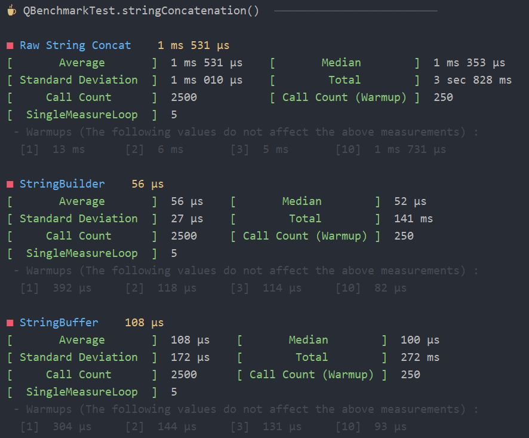

# 🐕 qq-benchmark

**qq-benchmark** is a Kotlin library that can benchmark your code snippets with beautiful console output.
- Just copy and paste 🟦 Single-File version [QBenchmark.kt](src-single/QBenchmark.kt) into your project. 
- Or you can use 🟩 Split-File Jar version. See [Maven Dependency Section](#-split-file-jar-version-maven-dependency).
- Feel free to fork or copy to your own codebase.

## Example

### output
<p align="center">
    
</p>
<p align="center">
    
</p>

### code

Full Source  [QBenchmarkExample.kt](src-example/QBenchmarkExample.kt)

```kotlin
fun main() {
    qBenchmark {
        // Number of trials
        nTry = 500

        // If this instance has several [block]s, it will shuffle them in randomized order and measure the time.
        // [nSingleMeasureLoop] represents how many times a block is executed in one measurement.
        // Eventually, the code snippet in the [block] will be executed [nSingleMeasureLoop] * [nTry] times.
        nSingleMeasureLoop = 5

        // In the early executions, the execution of the [block] takes more time,
        // so we first perform some executions which are not counted in the measurements.
        nWarmUpTry = 50

        block("Raw String Concat") {
            var str = ""
            for (i in 1..3000) {
                str += i.toString()
            }
            str
        }

        block("StringBuilder") {
            val sb = StringBuilder()
            for (i in 1..3000) {
                sb.append(i.toString())
            }
            sb.toString()
        }

        block("StringBuffer") {
            val sb = StringBuffer()
            for (i in 1..3000) {
                sb.append(i.toString())
            }
            sb.toString()
        }
    }
}
```

Please see [QBenchmarkTest.kt](src-test-split/nyab/util/QBenchmarkTest.kt) for more code examples.
Single-File version [src-test-single/QBenchmarkTest.kt](src-test-single/QBenchmarkTest.kt) is a self-contained source code that includes a runnable main function.
You can easily copy and paste it into your codebase.        

## 🟦 Single-File version Dependency

If you copy & paste [QBenchmark.kt](src-single/QBenchmark.kt).

Refer to [build.gradle.kts](build.gradle.kts) to directly check project settings.


```kotlin
dependencies {
    implementation("org.jetbrains.kotlin:kotlin-reflect:1.8.20")
    implementation("org.jetbrains.kotlin:kotlin-stdlib:1.8.20")
}
```

## 🟩 Split-File Jar version Maven Dependency

If you prefer a jar library. Add [jitpack.io](https://jitpack.io/#nyabkun/qq-benchmark) repository to the build script.

### build.gradle ( Groovy )
```groovy
repositories {
    ...
    maven { url 'https://jitpack.io' }
}

dependencies {
    implementation 'com.github.nyabkun:qq-benchmark:v2023-05-22-bc02'
}
```

### build.gradle.kts ( Kotlin )
```kotlin
repositories {
    ...
    maven("https://jitpack.io")
}

dependencies {
    implementation("com.github.nyabkun:qq-benchmark:v2023-05-22-bc02")
}
```

### pom.xml
```xml
<repositories>
    ...
    <repository>
        <id>jitpack.io</id>
        <url>https://jitpack.io</url>
    </repository>
</repositories>

<dependencies>
    ...
    <dependency>
        <groupId>com.github.nyabkun</groupId>
        <artifactId>qq-benchmark</artifactId>
        <version>v2023-05-22-bc02</version>
    </dependency>
</dependencies>
```

## How did I create this library

I created this library by developing a program within my own codebase that automatically resolves dependencies at the method or property level, extracts necessary code elements, and generates a compact, self-contained, single-file library.

The program uses [PSI](https://plugins.jetbrains.com/docs/intellij/psi.html) to resolve dependencies for function calls and references to classes.

Although my original repository is currently disorganized, I have been gradually extracting and publishing small libraries. I also plan to prepare the original repository for publication in the future

